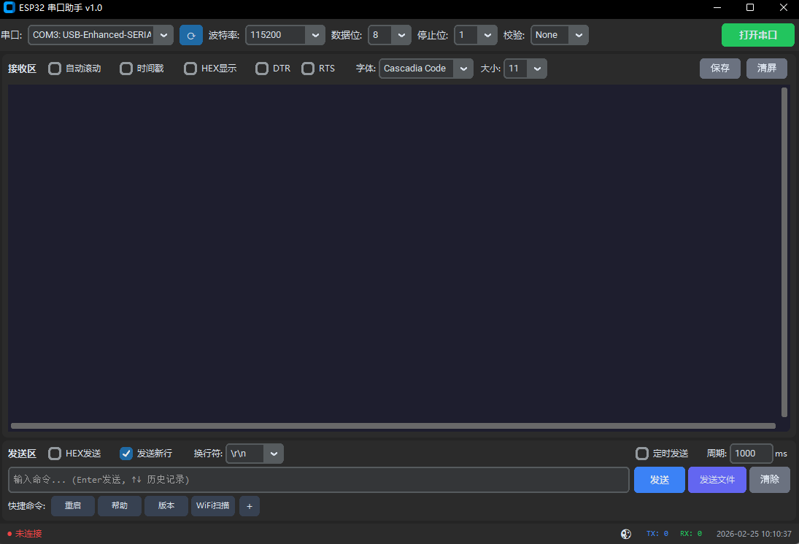

# 轻量级串口助手（ESP32 串口助手）

一个基于 **Python + CustomTkinter + pyserial** 的轻量级串口调试工具，面向 ESP32/MCU 日常串口交互场景：收发数据、HEX 显示、自动发送、快捷命令、日志保存等。

## 运行截图

> 截图位于 `pic/` 目录下。



## 功能特性

- **串口设备选择**
  - 下拉选择串口设备
  - 支持手动刷新
  - 支持自动刷新设备列表（热插拔后会自动更新列表）
- **常用串口参数**
  - 波特率、数据位、停止位、校验
  - DTR / RTS 控制
- **接收区**
  - 自动滚动
  - 时间戳显示
  - HEX 显示（按工具界面开关为准）
- **发送区**
  - 支持多种换行方式
  - 支持 HEX 发送（按工具界面开关为准）
  - 自动发送（定时发送）
  - 文件发送
- **快捷命令**
  - 可添加常用命令按钮，提升调试效率
- **统计与日志**
  - RX/TX 计数统计
  - 支持保存日志到本地文件
- **外观与字体**
  - 明/暗主题切换
  - 字体与字号设置

## 环境要求

- Windows（项目内包含 `启动.bat` / `build.bat`，默认面向 Windows 使用体验）
- Python 3.8+（推荐 3.10+）

## 安装依赖

建议使用虚拟环境：

```bash
python -m venv .venv
.\.venv\Scripts\activate
pip install -r requirements.txt
```

## 运行方式

### 方式 1：直接运行 Python 脚本

```bash
python serial_assistant.py
```

### 方式 2：双击启动脚本

- 双击 `启动.bat`

> 若你的电脑未正确配置 Python 环境变量，请先安装 Python 并勾选“Add Python to PATH”。

## 配置文件说明

- 配置文件：`config.json`
- 程序启动会读取配置，关闭时会写回保存。

其中包含但不限于：

- `port`：上次使用的串口（如 `COM3`）
- `baudrate`：波特率
- `databits`：数据位
- `stopbits`：停止位
- `parity`：校验
- `theme`：主题（light/dark）
- `font_family` / `font_size`：字体设置
- `cmd_history`：历史发送记录
- `port_auto_refresh_interval_ms`：串口列表自动刷新间隔（毫秒，默认 1000）

## 打包说明（可选）

项目内包含 `ESP32串口助手.spec` 以及 `build.bat`，用于使用 PyInstaller 打包（如需）。

一般流程（仅供参考，以你的 `build.bat` 为准）：

```bash
pip install pyinstaller
pyinstaller ESP32串口助手.spec
```

打包产物通常位于 `dist/`。

## 常见问题（FAQ）

### 1. 找不到串口 / 列表为空

- 确认设备已插入、驱动已安装（CH340/CP210x/FTDI 等）
- 在设备管理器中确认是否出现对应 COM 口
- 点击界面“⟳”手动刷新，或等待自动刷新更新

### 2. 打开串口失败

- 串口可能被其他软件占用（如 Arduino IDE、PlatformIO Monitor、其他串口工具）
- 关闭占用程序后重试

### 3. 串口输出乱码

- 检查波特率是否与固件一致
- 若固件输出非 UTF-8，可能需要在代码层面增强编码处理（可在后续版本优化）

## License
Apache-2.0
